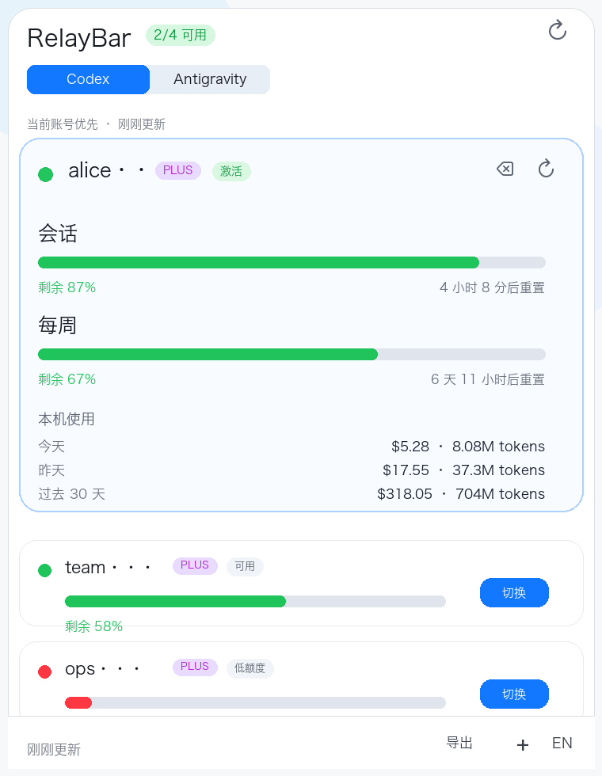
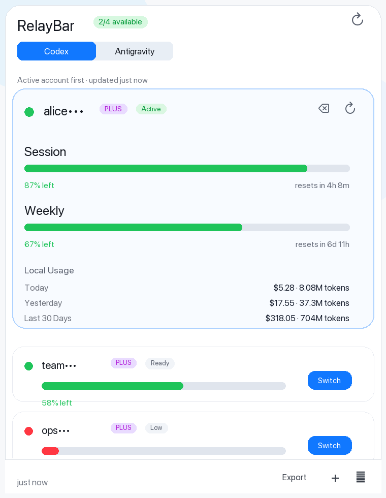
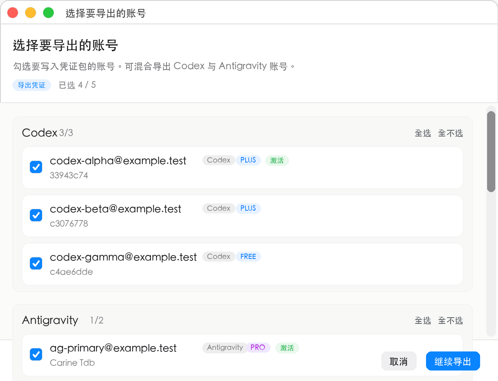
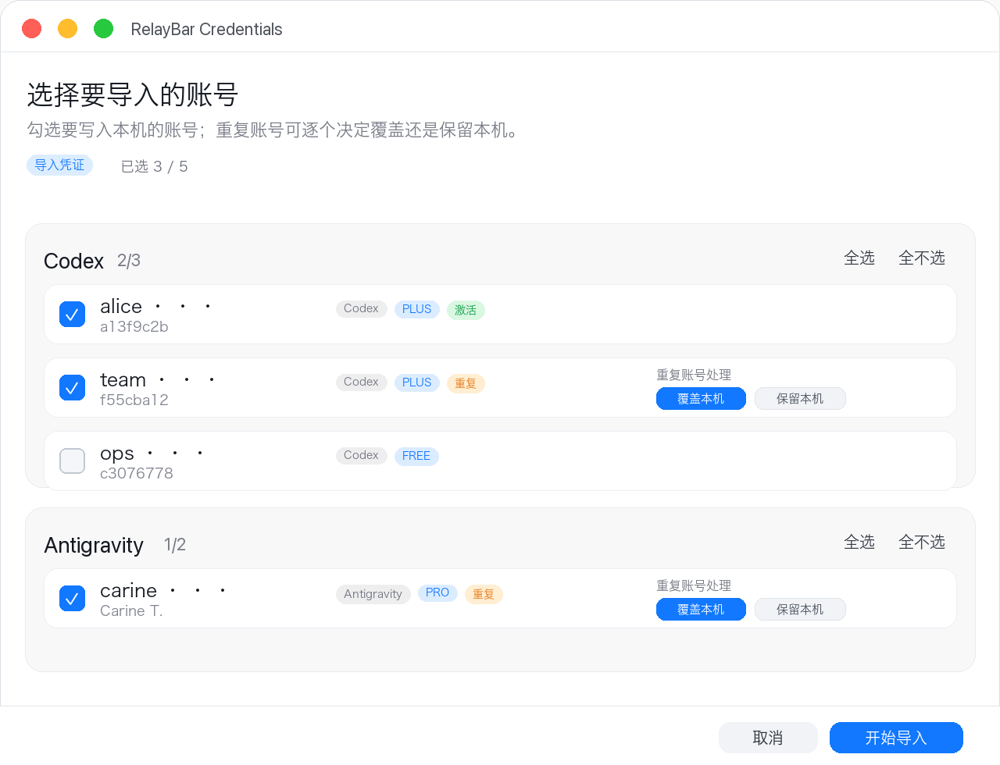

# RelayBar

RelayBar 是一个 macOS 状态栏工具，用来集中管理 Codex 与 Antigravity 账号池、查看额度和本机用量，并在需要时手动切换到另一个已认证账号。

[下载最新版](https://github.com/handong66/relaybar-open/releases/latest) · [English summary](#english-summary)



## 功能

- **Codex 账号池**：通过 OAuth 添加多个 Codex / ChatGPT 账号，并把选中的账号写入 Codex 使用的认证文件。
- **Antigravity 账号池**：从官方 Antigravity 当前登录导入账号，保存本地登录快照，并支持之后一键切换回已保存账号。
- **额度与状态**：以“剩余”语义展示账号额度、百分比、重置时间、过期状态和禁用状态。
- **Codex 本机用量**：在 Codex 激活账号卡片中展示 Today、Yesterday、Last 30 Days 的本机用量统计。
- **手动切换优先**：RelayBar 不会因为低额度自动切换账号；所有账号切换都由用户主动触发。
- **选择性凭证迁移**：导入或导出凭证时可逐个选择 Codex / Antigravity 账号，并处理重复账号。
- **本地安全默认值**：敏感账号池文件和导出文件写入时使用私有权限；公开源码和发行包不提供 Antigravity Google OAuth client secret。

## 当前界面

主面板采用 Active First 布局：当前激活账号显示完整额度和本机使用，其它账号压缩为次级卡片，避免状态栏面板过高。



凭证导出会先进入账号选择窗口。你可以只勾选要写入凭证包的 Codex / Antigravity 账号，顶部会显示已选数量，确认后再选择保存位置。



凭证导入会先预览文件中的账号，再选择要导入的子集。重复账号会在行内标记，并可逐项选择覆盖本机或保留本机。



## 安装

推荐直接下载 GitHub Release：

1. 打开 [RelayBar Releases](https://github.com/handong66/relaybar-open/releases/latest)。
2. 下载 `RelayBar-v1.0.0-macOS.dmg` 或 `RelayBar-v1.0.0-macOS.zip`。
3. DMG：挂载后把 `RelayBar.app` 拖入 `/Applications`。ZIP：解压后把 `RelayBar.app` 拖入 `/Applications`。
4. 首次打开时，如果 macOS Gatekeeper 阻止启动，请在 Finder 中右键点击 `RelayBar.app`，选择“打开”。

当前公开包采用 ad-hoc codesign，未做 Apple notarization。首次打开提示属于预期行为。

## 使用

1. 启动 RelayBar 后，点击状态栏中的 RelayBar 图标打开面板。
2. 使用顶部的 `Codex / Antigravity` 切换不同 provider 的账号池。
3. Codex：点击 `+` 添加账号，完成浏览器 OAuth 后保存到账号池。
4. Antigravity：先在官方 Antigravity 登录目标账号，再回 RelayBar 点击 `导入当前登录`。
5. 点击账号卡片中的刷新按钮更新额度。
6. 点击账号卡片中的切换按钮，把该账号设为对应 provider 的当前账号。
7. Codex 可能需要重新启动才能读取新认证文件；Antigravity 切换成功后 RelayBar 会自动重新打开 Antigravity。

## Antigravity 授权模型

公开版的默认 Antigravity 流程以官方 Antigravity 当前登录为授权来源：

- `导入当前登录`：读取本机 Antigravity 的 `state.vscdb` 和 `storage.json`，把当前登录账号和本地登录快照保存到 RelayBar 账号池。
- `切换`：先尝试退出 Antigravity，备份并写入 `storage.json` / `state.vscdb`，成功后自动打开 Antigravity。
- `重新授权`：从官方 Antigravity 当前登录更新目标账号。如果当前官方登录不是目标账号，RelayBar 会打开 Antigravity 并提示先在那里登录目标账号。
- `授权配置`：仅用于用户自带 Google OAuth client。配置保存在本机 macOS Keychain，不写入 Git 仓库，也不会进入凭证导出文件。

如果你确实需要 RelayBar 直接执行 Antigravity OAuth，可使用以下任一方式提供自己的 Google OAuth client：

```sh
export RELAYBAR_ANTIGRAVITY_GOOGLE_CLIENT_ID="YOUR_CLIENT_ID.apps.googleusercontent.com"
export RELAYBAR_ANTIGRAVITY_GOOGLE_CLIENT_SECRET="YOUR_CLIENT_SECRET"
export RELAYBAR_ANTIGRAVITY_CLOUD_CODE_BASE_URL="https://daily-cloudcode-pa.sandbox.googleapis.com"
```

也可以创建本地配置文件 `~/.config/relaybar/antigravity-oauth.json`：

```json
{
  "google_client_id": "YOUR_CLIENT_ID.apps.googleusercontent.com",
  "google_client_secret": "YOUR_CLIENT_SECRET",
  "cloud_code_base_url": "https://daily-cloudcode-pa.sandbox.googleapis.com"
}
```

`cloud_code_base_url` 可省略。不要把这个文件提交到 Git 仓库。

## 数据路径

RelayBar 保持现有 Codex 与 Antigravity 业务数据路径，方便迁移和兼容旧版本：

- Codex 账号池：`~/.codex/token_pool.json`
- Codex 当前认证：`~/.codex/auth.json`
- Antigravity 账号池：`~/.codex/antigravity_pool.json`
- Antigravity 本地设备状态：`~/Library/Application Support/Antigravity/User/globalStorage/storage.json`
- Antigravity 本地登录状态：`~/Library/Application Support/Antigravity/User/globalStorage/state.vscdb`
- 用户自带 Antigravity OAuth 文件配置：`~/.config/relaybar/antigravity-oauth.json`
- 用户自带 Antigravity OAuth Keychain 配置：service `com.relaybar.antigravity-oauth`，account `google-client`

兼容行为：

- Codex 账号池顶层保持 `{"accounts":[...]}`。
- Antigravity 账号池保持 `{"version":1,"current_account_id":"...","accounts":[...]}`。
- 读取 Codex 认证时兼容 `CODEX_HOME/auth.json`、`~/.codex/auth.json` 和 `~/.config/codex/auth.json`。
- 写入账号池或认证文件前会尽量保留备份，避免把磁盘上的有效账号池误写为空。
- 新版凭证包类型为 `relaybar.credentials`，旧版凭证包仍可导入。
- App 当前 bundle identifier 是 `com.handong66.relaybar`；旧 `xmasdong.relaybar` 只作为设置迁移来源。

## 凭证安全

`RelayBar-Credentials-*.json` 是明文敏感文件，可能包含 access token、refresh token、ID token、设备状态、账号标识和 quota snapshot。请按密码文件处理：

- 不要上传到公开仓库、网盘公开链接、issue、pull request、日志或聊天群。
- 只导出确实需要迁移的账号。
- 导入完成后删除临时传输文件。
- 如果凭证文件曾经泄露，请重新登录相关账号，使旧 token 失效。

仓库 `.gitignore` 已排除常见敏感文件，包括 `.env*`、`RelayBar-Credentials-*.json`、`token_pool.json`、`auth.json`、`antigravity_pool.json`、`antigravity-oauth.json`、`*.vscdb`、`*.sqlite` 和 `*.db`。

## 从源码构建

```sh
git clone https://github.com/handong66/relaybar-open.git
cd relaybar-open
open RelayBar.xcodeproj
```

也可以使用仓库内脚本生成本地 `.app`：

```sh
./scripts/package_app.sh
```

打包产物位于 `build/RelayBar.app`。发布前维护者应运行：

```sh
./scripts/run_foundation_tests.sh
gitleaks detect --no-git --redact --source .
gitleaks detect --redact
```

## 限制与风险

- RelayBar 不是 OpenAI、Google、Codex 或 Antigravity 的官方产品。
- RelayBar 使用的部分额度接口和本地状态文件不是官方稳定 API，未来可能变化。
- Codex 切换本质是写入本地认证文件；目标应用是否立即读取，取决于它自身的运行状态。
- Antigravity 切换会修改本机 `storage.json` 和 `state.vscdb`，RelayBar 会先备份再写入，但仍建议只在你自己的 Mac 上使用。
- RelayBar 只做手动切换，不做低额度自动切换。

## English Summary

RelayBar is a local macOS menu bar utility for managing Codex and Antigravity account pools. It shows remaining quota, local Codex usage for Today / Yesterday / Last 30 Days, and lets you manually switch the active account for each provider.

Install from the latest release: <https://github.com/handong66/relaybar-open/releases/latest>

Release assets for the reset `v1.0.0` public release are:

- `RelayBar-v1.0.0-macOS.dmg`
- `RelayBar-v1.0.0-macOS.zip`

Important local paths:

- Codex account pool: `~/.codex/token_pool.json`
- Codex active auth: `~/.codex/auth.json`
- Antigravity account pool: `~/.codex/antigravity_pool.json`
- Antigravity local state: `storage.json` and `state.vscdb` under Antigravity global storage

Antigravity support is based on importing the current login from the official Antigravity app and restoring captured local login snapshots. Direct Antigravity OAuth requires your own Google OAuth client saved locally through OAuth Setup, environment variables, or `~/.config/relaybar/antigravity-oauth.json`.

Credential exports are plaintext JSON files containing sensitive tokens and device state. Store them securely and delete temporary transfer copies after import.

## License

[MIT](LICENSE)
